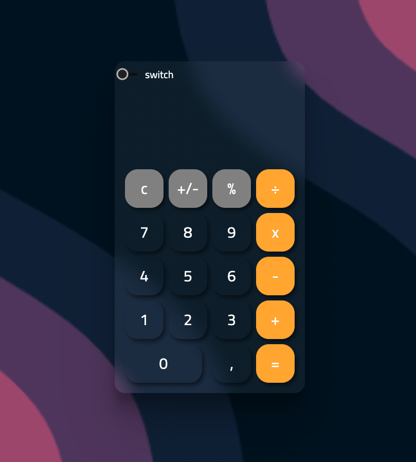
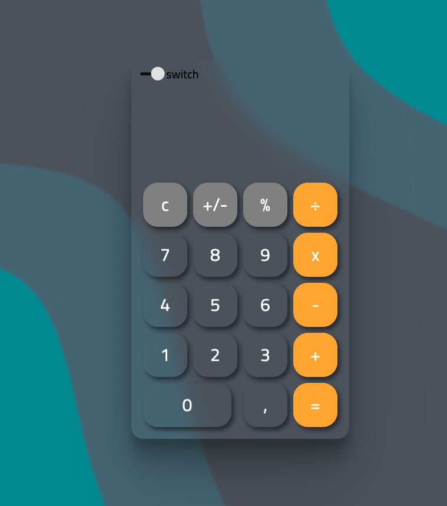

# The Calculator

## Projeto criado como portfólio

<h1 align="center">
  
</h1>

<h1 align="center">
  
</h1>

### 🛠 Tecnologias

As seguintes ferramentas foram usadas na construção do projeto:

-[HTML]
-[CSS]
-[JavaScript]
-[Git]
-[GitHub]

#  Funcionalidade do projeto
    -Uma calculadora bem minimalista, com a funcão DarkMode
